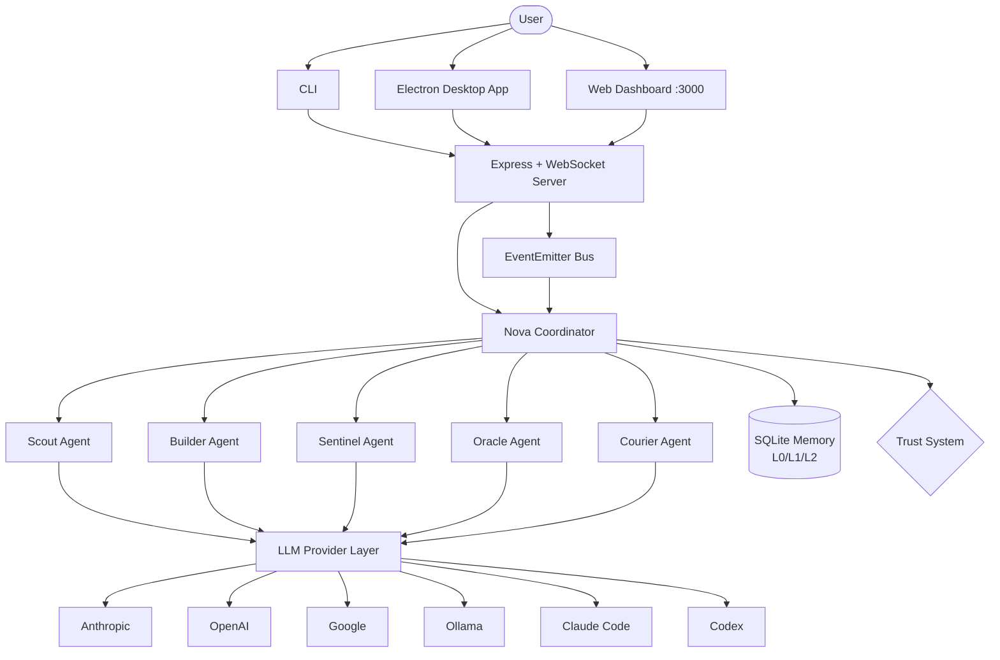

<div align="center">

```
 ██╗  ██╗██╗██╗   ██╗███████╗███╗   ███╗██╗███╗   ██╗██████╗
 ██║  ██║██║██║   ██║██╔════╝████╗ ████║██║████╗  ██║██╔══██╗
 ███████║██║██║   ██║█████╗  ██╔████╔██║██║██╔██╗ ██║██║  ██║
 ██╔══██║██║╚██╗ ██╔╝██╔══╝  ██║╚██╔╝██║██║██║╚██╗██║██║  ██║
 ██║  ██║██║ ╚████╔╝ ███████╗██║ ╚═╝ ██║██║██║ ╚████║██████╔╝
 ╚═╝  ╚═╝╚═╝  ╚═══╝  ╚══════╝╚═╝     ╚═╝╚═╝╚═╝  ╚═══╝╚═════╝
```

### The Open-Source Autonomous Agent Swarm

[](LICENSE)
[](https://www.typescriptlang.org/)
[](src/)
[](https://nodejs.org/)

[Quick Start](#-quick-start) · [Agent Roster](#-the-agent-roster) · [Architecture](#-architecture) · [Skills](#-skills-system) · [Configuration](#%EF%B8%8F-configuration)

</div>

---

## What is HIVEMIND?

HIVEMIND is an autonomous agent swarm platform that coordinates specialized AI agents to accomplish complex tasks. Instead of one monolithic agent trying to do everything, HIVEMIND deploys a team: a **Scout** gathers intelligence, a **Builder** writes code, a **Sentinel** guards quality, an **Oracle** analyzes data, and a **Courier** handles communications -- all orchestrated by **Nova**, the coordinator that breaks down requests, delegates work, and synthesizes results.

Each agent runs its own cognitive loop (think, act, observe) and communicates through an event-driven message bus. A hierarchical memory system (L0 summaries, L1 overviews, L2 full content) keeps agents context-aware without blowing through token budgets. A trust system controls what each agent can do based on where a task originated -- CLI commands get full access, webhook inputs get sandboxed.

HIVEMIND runs locally on your machine via a desktop Electron app or CLI, connects to multiple LLM providers (Anthropic, OpenAI, Google, Ollama, Claude Code, Codex), and exposes a real-time web dashboard over WebSocket. It is TypeScript from top to bottom, stores everything in SQLite, and requires zero cloud infrastructure.

---

## 🐝 The Agent Roster

| Agent | Role | Specialty |
|-------|------|-----------|
| 🌐 **Nova** | Coordinator | Orchestrates the swarm. Breaks tasks into subtasks, delegates to specialists, synthesizes final results. Runs as a subprocess with streaming output. |
| 🔍 **Scout** | Reconnaissance | Searches the web, APIs, and feeds. Gathers context and intelligence. Supports multimodal inputs (images, audio, documents). First responder for new tasks. |
| 🔨 **Builder** | Construction | Writes code, generates documents, creates build artifacts. Supports Vercel, Railway, Docker, and local targets with full CI/CD pipeline tracking. |
| 🛡 **Sentinel** | Protection | Monitors agent health, validates outputs, runs security audits. Tracks alerts by severity (info, warning, critical) and enforces quality gates. |
| 🔮 **Oracle** | Analysis | Deep data analysis, trend detection, and forecasting. Identifies patterns, generates statistical models, and recommends strategies with confidence intervals. |
| 📬 **Courier** | Delivery | Routes messages across Slack, Discord, Telegram, WhatsApp, and email. Manages priority levels, rate limiting, and delivery confirmation. |

Agents coordinate automatically -- a Scout discovers context, passes it to a Builder, the Sentinel validates the output, an Oracle analyzes results, and a Courier delivers the final product.

---

## 🏗 Architecture



**Key subsystems:**

| Layer | What it does | Where it lives |
|-------|-------------|----------------|
| **Orchestrator** | Task queue, agent lifecycle, swarm deployments, priority routing | `src/core/orchestrator.ts` |
| **LLM Adapter** | Unified interface across all providers, streaming, function calling | `src/core/llm.ts` |
| **Trust System** | Owner/Trusted/Untrusted classification, per-task permissions, path restrictions | `src/core/trust.ts` |
| **Memory Store** | SQLite-backed hierarchical memory with vector search and progressive loading | `src/memory/` |
| **Dashboard** | Express server, WebSocket real-time updates, workspace tracking, swarm visualization | `src/dashboard/` |
| **Desktop App** | Electron wrapper, chat UI (vanilla HTML/JS), connects to backend via WebSocket | `desktop/` |

---

## ⚡ Quick Start

**Prerequisites:** Node.js >= 20, pnpm (or npm)

```bash
# 1. Clone and install
git clone https://github.com/hivemind-swarm/hivemind.git
cd hivemind
pnpm install

# 2. Initialize a project
pnpm start -- init

# 3. Set your API keys
echo "ANTHROPIC_API_KEY=sk-ant-..." >> .env

# 4. Start the swarm
pnpm start -- up
# Dashboard available at http://localhost:3000
```

Or use it as a CLI directly after building:

```bash
pnpm build
npx hivemind init
npx hivemind up
```

The `init` command walks you through project setup interactively -- project name, primary LLM model, dashboard port -- and generates a `hivemind.yaml` config file.

---

## ✨ Features

- **Multi-agent coordination** -- Five specialized agents + Nova coordinator with autonomous task delegation
- **Multiple LLM providers** -- Anthropic, OpenAI, Google, Ollama, Claude Code, and Codex with fallback chains
- **Trust-based security** -- Three-tier trust system (Owner, Trusted, Untrusted) with per-task permissions, path restrictions, and command blocking
- **Hierarchical memory** -- SQLite-backed L0/L1/L2 memory model with vector search; keeps context lean, drills into detail on demand
- **Real-time dashboard** -- Express + WebSocket server with live agent status, task orchestration, and swarm visualization
- **Desktop app** -- Electron app with chat UI for interacting with your swarm locally
- **Skills system** -- Folder-based skills with YAML frontmatter, progressive disclosure, and hot-reload
- **Cognitive loop** -- Each agent runs think/act/observe cycles with confidence scoring and tool execution
- **Event-driven messaging** -- EventEmitter-based inter-agent communication with typed messages (task, result, query, broadcast, heartbeat)
- **Task journaling** -- Full audit trail of task execution with adaptive strategy and learning loops
- **Multimodal support** -- Scout handles images, audio, and document extraction via pluggable vision providers
- **Platform connectors** -- Slack, Discord, Telegram, WhatsApp, email, and webhook integrations
- **Local-first** -- Runs entirely on your machine, SQLite for storage, no cloud infrastructure required

---

## 📝 Skills System

Skills are **folders, not files**. Each skill uses progressive disclosure -- a main `SKILL.md` that agents read first, plus reference docs, examples, and scripts they pull in as needed.

```
skills/
  code-review/
    SKILL.md              # Core instructions (always loaded)
    references/api.md     # Detailed specs (read on demand)
    examples/good.ts      # Correct usage patterns
    scripts/validate.ts   # Executable helpers
    config.json           # User-specific settings
```

Skills use YAML frontmatter for metadata:

```markdown
---
name: code-review
agent: sentinel
trigger: on-pr-open
providers: [claude, gpt-4o]
timeout: 300s
---

# Code Review

Review pull requests for security vulnerabilities, performance
issues, and missing test coverage. Output a structured JSON report
with severity-rated findings.
```

Skills fall into 9 categories: library reference, product verification, data fetching, business process automation, code scaffolding, code quality, CI/CD, runbooks, and infrastructure operations. See [`skills/SKILL_DESIGN_GUIDE.md`](skills/SKILL_DESIGN_GUIDE.md) for the full design guide.

---

## ⚙️ Configuration

HIVEMIND uses a layered configuration model: **CLI args > environment variables > hivemind.yaml > defaults**.

Copy the example config to get started:

```bash
cp hivemind.example.yaml hivemind.yaml
```

Key sections of `hivemind.yaml`:

```yaml
# LLM providers with fallback chain
llm:
  primary:
    provider: anthropic
    model: claude-sonnet-4-20250514
    apiKey: ${ANTHROPIC_API_KEY}
  fallback:
    - provider: ollama
      model: llama3.2
      baseUrl: http://localhost:11434

# Agent definitions
agents:
  coordinator:
    role: coordinator
    model: anthropic/claude-sonnet-4-20250514
    skills: [task-planning, delegation]
  researcher:
    role: researcher
    skills: [web-search, summarization]

# Platform connectors
connectors:
  - type: slack
    config:
      token: ${SLACK_BOT_TOKEN}
  - type: discord
    config:
      token: ${DISCORD_BOT_TOKEN}

# Dashboard
dashboard:
  enabled: true
  port: 3000

# Storage
storage:
  type: sqlite
  path: ./data/hivemind.db
  walMode: true
```

See [`hivemind.example.yaml`](hivemind.example.yaml) for the full annotated configuration reference with all available options.

### Environment Variables

| Variable | Purpose |
|----------|---------|
| `ANTHROPIC_API_KEY` | Anthropic API access |
| `OPENAI_API_KEY` | OpenAI API access |
| `GOOGLE_API_KEY` | Google AI API access |
| `SLACK_BOT_TOKEN` | Slack connector |
| `DISCORD_BOT_TOKEN` | Discord connector |
| `TELEGRAM_BOT_TOKEN` | Telegram connector |
| `DASHBOARD_PASSWORD` | Dashboard basic auth |

---

## 🛠 Development

```bash
# Install dependencies
pnpm install

# Start in dev mode (hot-reload via tsx)
pnpm dev

# Build
pnpm build

# Type-check without emitting
pnpm typecheck

# Run tests (Vitest)
pnpm test

# Run tests in watch mode
pnpm test:watch

# Lint
pnpm lint

# Format
pnpm format
```

### Project Structure

```
src/
  agents/       # BaseAgent + 5 specialized agents (Scout, Builder, Sentinel, Oracle, Courier)
  core/         # LLM adapter, providers, orchestrator, trust system, tool execution
  memory/       # SQLite store, L0/L1/L2 hierarchy, context manager
  dashboard/    # Express + WebSocket server, swarm graph, workspace tracker
  cli/          # CLI entry point, commands (init, up, task), system prompts
desktop/        # Electron app, chat UI (vanilla HTML/JS)
skills/         # Built-in skills, design guide
```

---

## 🧱 Tech Stack

| Component | Technology |
|-----------|-----------|
| Language | TypeScript 5.7 (strict mode, ES2022) |
| Runtime | Node.js >= 20 |
| Database | SQLite via better-sqlite3 |
| HTTP Server | Express 4 |
| Real-time | WebSocket (ws) |
| Desktop | Electron |
| CLI | Commander |
| Config | YAML (yaml) |
| Testing | Vitest 4 |
| Build | tsc (TypeScript compiler) |
| Dev | tsx (watch mode) |

---

## 📄 License

HIVEMIND is [MIT licensed](LICENSE).

---

<div align="center">

**Built by the [HIVEMIND community](https://github.com/hivemind-swarm/hivemind/graphs/contributors).**

[Back to top](#)

</div>
